# Blogspot
### Project Overview
This website was designed for users to be able to sign up and communicate their interest together and find out more about the world. learning new things one step at a time. I believe that this is best done in a wam community where people can work and talk nicely together and get lost within the interesting topics that every knows.
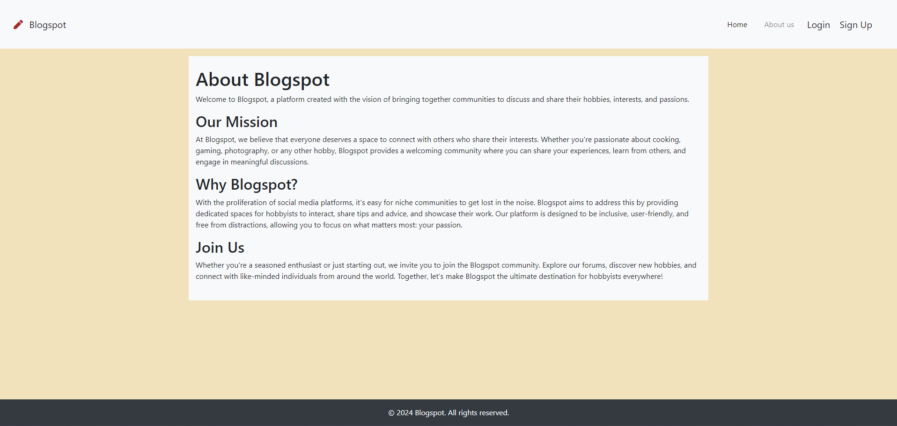

### Process
This project stared with the idea that often times larger communities can be quite toxic and building a smaller more niche community could enable people to enjoy themselves more when talking about what they enjoy better together.

### Design
With this website, I took a lighter more cosy theme utilising whites, creams and browns in order to give a more cheery homey vibe much like that of coffee or tea that would induce a more relaxed feeling within the user.
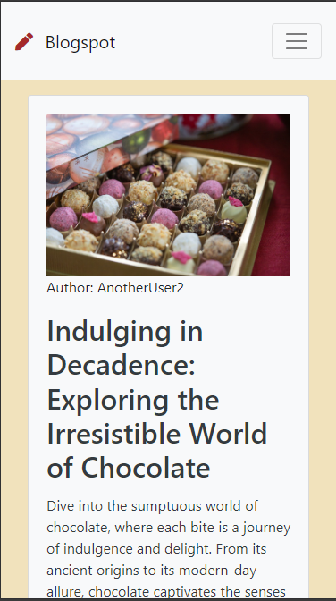

### Development
The Development process was carried out with agile thoughts in mind and trying to ensure that the design was as responsive to mobile devices as possible. The project was managed using a GItHub Project board that gave a rough outline of the key features that I had thought to include

### User Stories
As a user I set out to think of the key features that would be required within the blog website. For this project I name too many and have used completed core features of the website and look to further imrpove this website in the future when my skills become greater.
From this I set aside the features that I believed were the most core:

As a site user I can access a clear and well-designed webpage so that I can use the benefits of the website
- Have a clear, well-laid-out webpage
- Web pages are responsive to different devices
- Web pages are applicable across different pages on the website

As a site user, I can view the About page of the website to see what the objective of the website is for and what it can be used for:
- The User can view the About/FAQ page of the website
- The website admin can edit the About/FAQ page of the website
- The About/FAQ page gives information about the website to the users that allow them to understand what the use and objective of the site is

As a site user I can open posts so that I can view the information within
- Find the post that I want to read on the main page
- Click on the post that I would like to view on the main page
- View the post I would like to see

As a site user I can view a paginated list of posts so that I can browse through posts to see what interests me
- The posts are collapsed and paginated with enough information to tell what the post is about
- Allow scrolling through these paginated posts to allow users to click on what interests them the most
- List of posts is displayed on the main page

As a site user I can view likes and comments on a post so that I can view user interactions with posts and find community responses to information
- View likes and reactions to a post
- View comments that people have made on a post and other comments

As a site user I can log in so that I can create posts and comments that can interact with other users and be identified
- Add a suitable login screen that uses error handling to make sure that correct details are input
- Send user log-in data to the secure database

As a ** site user** I can create an account so that I access the information on the forum
- Be able to create a user with user details and password.
- Add validation to the registration page so that identification is unique.
- Allow management of user details and allow the changing of details post registration.

with others to follow later on when I can.

### Data models
In addition to this I followed Code Institute's "I think therefore I blog" guide whilst doing this project and followed the Data Models that I created during the lesson.

## Features

### Authentication and Authorization:
Used account authorization to enable certain features such as posting and commenting. This is so that only people who are authenticated will be able to post and there will not be anonymous people on the website.

Above shows a logged in user using the website compared to a non authorized user below:

#### Password Validation
Below are three examples of ways that the site has validated and authenticated to ensure that the user has their password during the sign up process, to prevent mistakes:

The signup process forces fields to all be filled in order for the user to successfully sign up for the website:
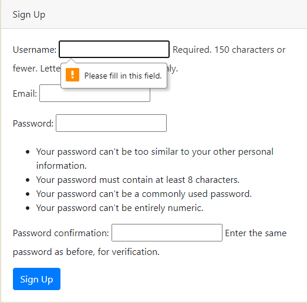
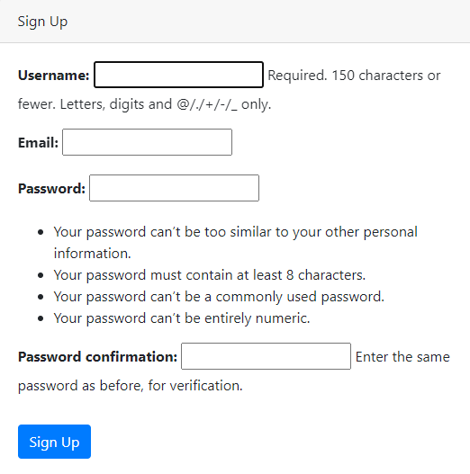

### Login page
The Login page enables users to login to access more parts of the website. As the aim was to be as mobile friendly as possible, bootstrap css was used in order to allow elements to come together cleaner for smaller screens.
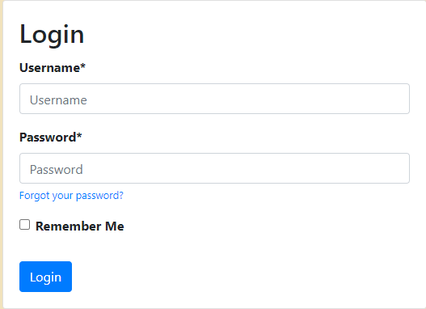
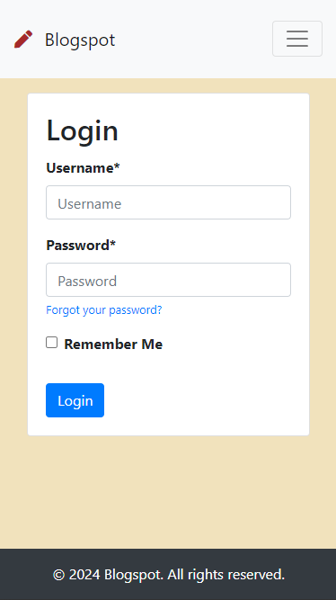

### Navigation
The nav bar at the top of the page is the main means of navigating throughout the site and it sits within the base.html file that all the other webpages are based from. It can be seen above with the validation images but for smaller deives the buttons become part of a collapsable burger button:

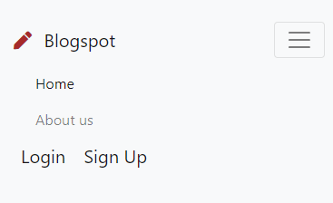

### Comments
The comments section of posts allow users to communicate with each other and adds a level of personality to any website. 
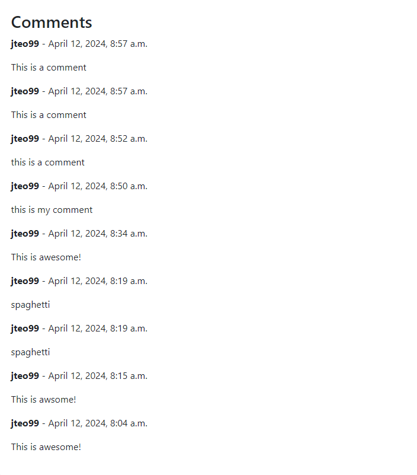
This comments section was completed using a form:
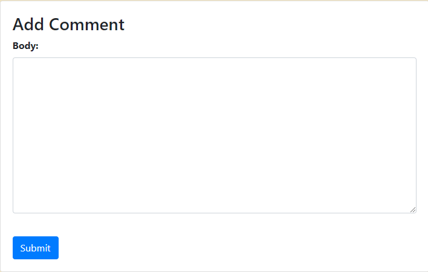
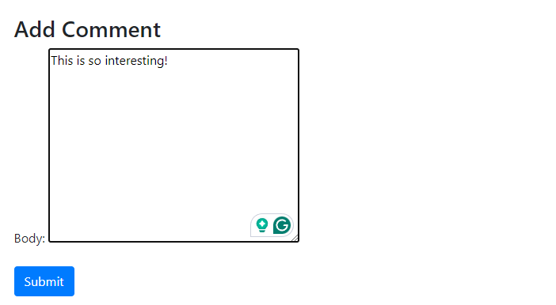

### Blog
The blog section takes up the most important part of the website as it is where individuals can share what they have learnt and things they have seen. It consists of two main ideas, the list view which shows multiple posts that may interest a user and a detialed view by which users will be able to read the blog in depth and not just an excerpt that has been written as a descriptor.
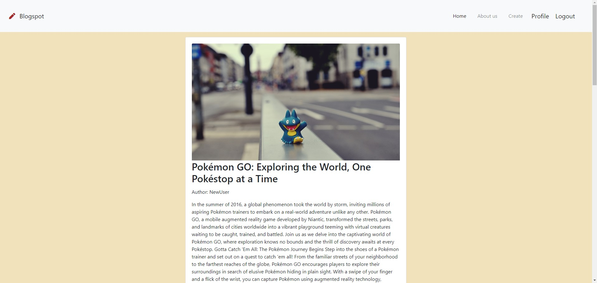
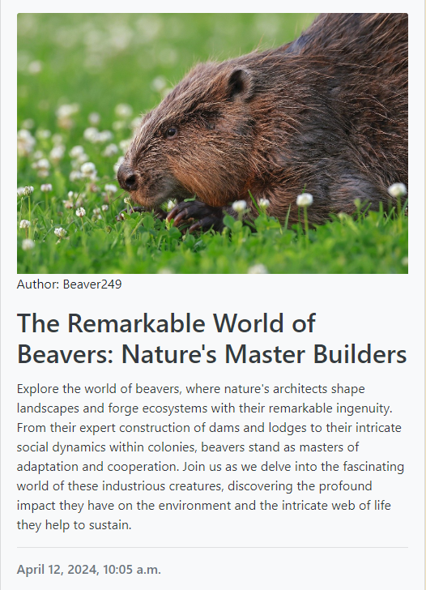

These blogs are created through the post form which is in charge of sending requests to the server to store the blogposts that the users have made.
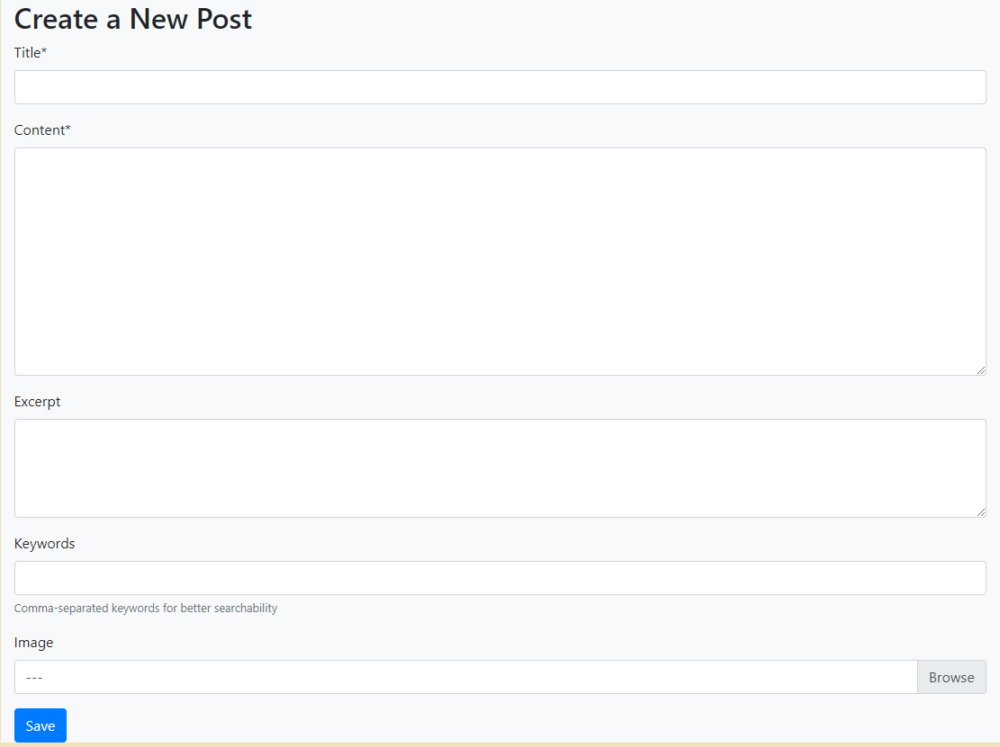
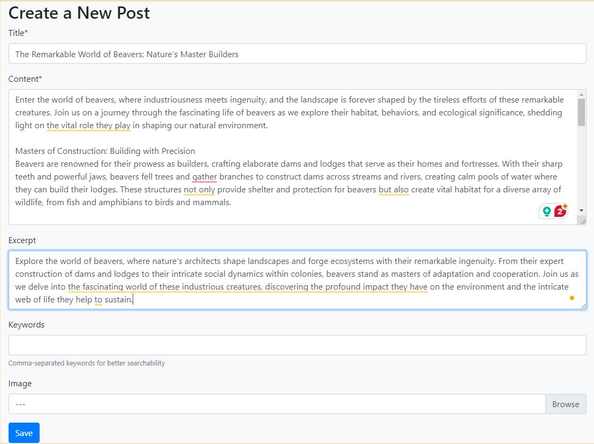

## Bugs
Throughout the time creating this website there were a few bugs that slowed the process of creating the website. The whole process I have had difficulties with sending to the database. This includes retrieving and rewriting data, which is why I will be looking to further implement features into this website in the future.
The comment function was successfully posting to the database but was not showing even though the retrieval function said it was fine. This debugging process came to an end when I followed the "I think therefore I blog" example to combine the views for the functions for the post list with the comments creation and the comments view functions as i believe that the separation was causing scaling issues which cause items to block each other and the code was getting confused between different URL patterns as a result.

An Issue that has remained till now has been the image post function, which has stopped working in deployment. When posting a blog, the user is able to upload an image but the image does not appear within the blogpost and it cannot be found on the cloudinary website either. This has confused me and is something that I wish to work on in the future in order to improve the website so I can also add other image features in it such as profile picture. Posting the image to the admin function still works and with the fact that the images are retrievable suggests that the issue is with the POST function which i plan to look at in the future.

## Technologies used:

### Core
-Django
-HTML
-CSS
-Django Templates
-Bootstrap CSS

### Python and Django packages
-gunicorn
-psycopg2
-whitenoise
-oauthlib
-Summernote
-Crispy-forms

### Infrastructure
-ElephantSQL
-Heroku
-Cloudinary

### Testing:

Testing was done through linters and responsiveness tests: [here](docs/validation/)
-W3C validator was passed with minimal errors
-Python  files passed through without errors and all syntax was fixed.
-User flows were tested and the website remained relatively responsive.
-Lighthouse shows that the website was quite responsive but image links caused the website to lose marks for best practices as the links were deemed insecure from cloudinary.
- wave was ued to test for accesssibilty and it was deemed that an extra home button is unneccessary which will be removed for later revisions.

### General Testing:
-General Navigation testing showed the links arrived at the appropriate destination each time although there was some delay due to the image sizes which could be deemed too big and may need to be limited in the future.
The form was reponsive to most viewports although amiresponsive did not like the website and would not load although in the developer tools the website worked fine.

### Deployment:

During production the website was run using pythong command: python3 manage.py runserver. This enabled me to troubleshoot the website whilst implementing code. There was an issue during production were I had forgotten to change the settings to allow for local hosting that caused me to push code too much during that period to test live on heroku whether the code was working. 

#### Heroku Deployment:
-Login to the Heroku dashboard and create a new app.
-Connect your GitHub repository to your Heroku app.
-In the Settings tab, ensure that the Python Buildpack is added.
-Set environment variables in the Config Vars section of the Settings tab.
-In the Deploy tab, enable automatic deploys from your GitHub repository.
-Click the "Deploy Branch" button to deploy the app.
-Once the app has been deployed, click the "Open App" button to view the app.

#### Environment variables:
-For local deployment, you will need to create a .env file in the root directory of the project and set the environment variables in this file.
-For Heroku deployment, you will need to set the environment variables through the Heroku CLI or through the Heroku dashboard under 'Config Vars'.
-You need to define the following variables:
-If using a Postgres database:
-DATABASE_URL - the URL for your Postgres database.
-NAME - the name of your database.
-USER - the username for your database.
-PASSWORD - the password for your database.
-HOST - the host for your database.
-PORT - the port for your database.
-Django settings:
-SECRET_KEY - the secret key for your Django project.
-DEBUG - set to True for development, False for production.

## Credits:
- Pixabay - Source of free use images for the blogs
- ChatGPT - Blogpost paragraphs and information
- Favicon.io - Icons to use for logo